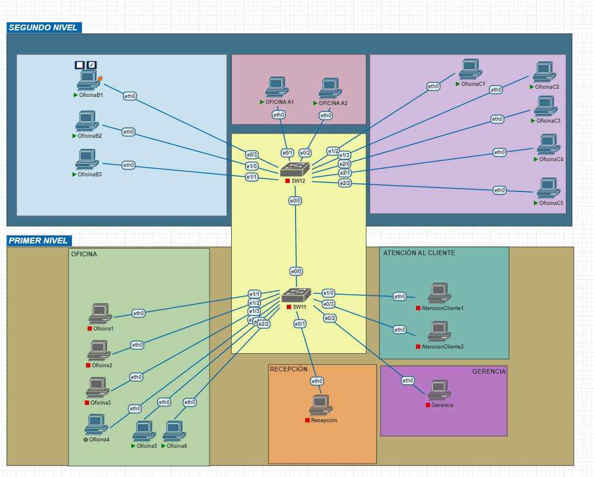
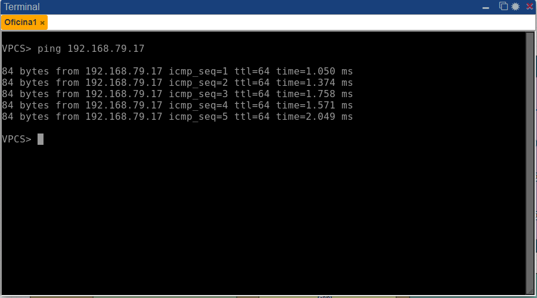
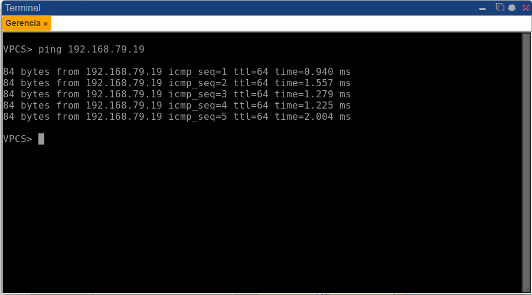
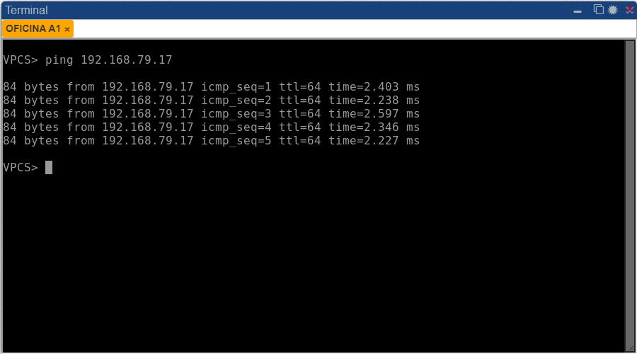
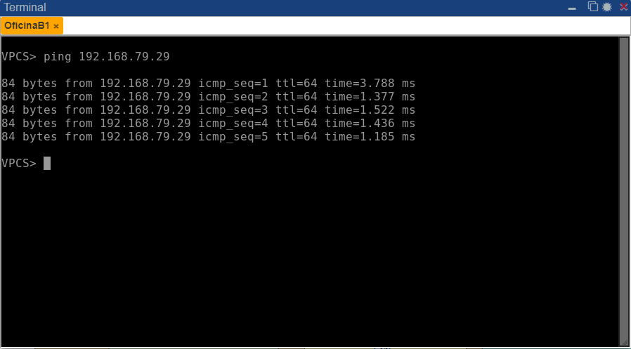
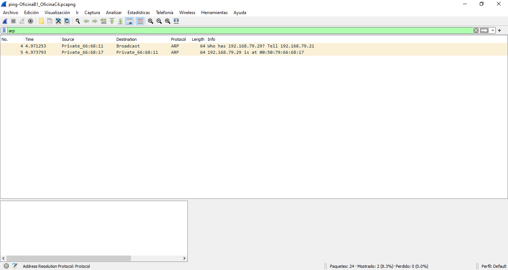

UNIVERSIDAD DE SAN CARLOS DE GUATEMALA

FACULTAD DE INGENIERIA

ESCUELA DE CIENCIAS Y SISTEMAS

LABORATORIO DE REDES Y COMPUTADORAS 1

PRIMER SEMESTRE 2023

ING. PEDRO PABLO HERNÁNDEZ RAMÍREZ

TUTOR EDWIN ANTONIO LÓPEZ ORDÓÑEZ

---

---

---

---

---

---

---

 <h1>PRACTICA #1</h1> 

 <h1>RED LOCAL PEQUEÑA</h1> 

---

---

---

---

| Nombre   |      Carnet      |  
|----------|:-------------:|
| Daniel Estuardo Chicas Carías    | 201807079 | 

---

---

---

---

---

---

---

---

---

---

# MANUAL DE TÉCNICO
Este documento contiene toda la información sobre los recursos utilizados por el programa para desplegarlo y utilizarlo, explicando todo el trabajo que se ha realizado al crear la calculadora.

>“Programa desarrollado en PNETLab y Wireshark que permite simular una topología de una red para un pequeño negocio de dos niveles.”
## ÍNDICE

| Topico | Link |
| ------ | ------ |
| Introducción | [Ir](#intro) |
| Información del sistema | [Ir](#inf) |
| Objetivos y alcances del sistema| [Ir](#ob) |
| Información del Sistema requerido | [Ir](#sis) |
| Sistema Operativo | [Ir](#sis) |
| Tecnologías utilizadas | [Ir](#tech) |
| Interfaz del programa | [Ir](#inter) |
| Conclusiones | [Ir](#Conclu) |

## INTRODUCCIÓN
El presente manual técnico tiene como finalidad describir la estructura y diseño del programa que se realizó como parte de Practica 1, así como dar explicación de los como usted como desarrollador puede mejorar y comprender el funcionamiento.

## Informacion del Sistema
La topología de red se define como un mapa físico o lógico de una red para intercambiar datos. En otras palabras, es la forma en que está diseñada la red, sea en el plano físico o lógico. El concepto de red puede definirse como «conjunto de nodos interconectados».

En esta práctica se realizó una topología de red básica, en donde se puede realizar ping entre computadoras de los 2 niveles, donde cada una tiene una ip asignada y se puede realizar captura de paquetes entre ellas.

## Objetivos y alcances del sistema

### Objetivo General
- Que el estudiante demuestre los conocimientos adquiridos en clase y cree una red local pequeña.
### Objetivos Específicos
- Demostrar el conocimiento adquirido respecto a los protocolos Ethernet, IP, ARP e ICMP.
- Demostrar el conocimiento requerido para la configuración de máquinas virtuales VPC y switches de capa 2.
- Emplear la herramienta PNETLab para desarrollar la topología de acuerdo con las especificaciones dadas.
- Emplear la herramienta Wireshark para realizar capturas de paquetes.

## Especificaciones del Sistema requerido

### Requisitos de Hardware 
|  | PNETLab | Wireshark |
| ------ | ------ | ------ |
|Memoria mínima|  1 GB| 1 GB|
|Memoria recomendada |  2 GB| 2 GB|
|Espacio en disco mínimo| 500 MB de espacio libre | 500 MB de espacio libre|
|Espacio en disco recomendado |  1 GB de espacio libre| 1 GB de espacio libre|
|Sistema operativo | Windows 7 o posterior, MacOS X 10.12 o posterior, o Linux con glibc 2.19 o posterior | Windows 7 o posterior, MacOS X 10.12 o posterior, o Linux con glibc 2.19 o posterior|
|Procesador | Intel Core i3 o equivalente | Intel Core i3 o equivalente|

### Requisitos de software
## Sistema operativo 
Windows
- Windows 10 (8u51 y superiors)
- Tener instalado el programa de Proteus y Librerias de Arduino Code u otro editor
- RAM: 128 MB
- Espacio en disco: 124 MB 
- Procesador: Mínimo Pentium 2 a 266 MHz 
- Algún explorador de internet
Mac OS X 
- Tener instalado el programa Proteus Code u otro editor
- Explorador de 64 bits 
- Se requiere un explorador de 64 bits (Safari, Firefox, por ejemplo) para ejecutar Oracle Java en Mac OS X.
Linux
- Oracle Linux 5.5+1 
- Oracle Linux 6.x (32 bits), 6.x (64 bits)2 
- Exploradores: Firefox

## Conclusiones

### PNETLab: 
- Es una herramienta de simulación de redes de computadoras que permite a los usuarios crear, simular y evaluar diferentes topologías de redes.
- Ofrece una interfaz gráfica de usuario intuitiva y fácil de usar para configurar y visualizar la simulación.
### Wireshark:
- Es una herramienta de análisis de paquetes de red que permite a los usuarios capturar, ver y analizar el tráfico de red en tiempo real.
- Ofrece una gran cantidad de filtros y opciones de análisis para ayudar a los usuarios a concentrarse en el tráfico relevante y a entender cómo funciona la red.

## Apéndice

  
## TOPOLOGÍA
  

  
## CONFIGURACIÓN DE PING DE COMPUTADORAS 
  <a href="#">
     # OFICINAS C SEGUNDO NIVEL 
    
     # OFICINAS A SEGUNDO NIVEL 
    
     # OFICINAS B SEGUNDO NIVEL 
    
     # ATENCIÓN AL CLIENTE PRIMER NIVEL 
    
     # GERENCIA PRIMER NIVEL
    
     # RECEPCIÓN PRIMER NIVEL 
    
     # OFICINAS PRIMER NIVEL 
    
  </a>
  
##  PINGS ENTRE HOSTS
  <a href="#">
     # PING OFICINA 1 A RECEPCIÓN (PRIMER NIVEL)
     
     # PING GERENCIA A ATENCIÓN AL CLIENTE (PRIMER NIVEL)
      
     # PING OFICINA A1 (SEGUNDO NIVEL) A RECEPCIÓN (PRIMER NIVEL)
     
     # PING OFICINA B1 A OFICINA C4 (SEGUNDO NIVEL)
     
  </a>
  
##  Demostración de la captura de un paquete ARP 
  
  

