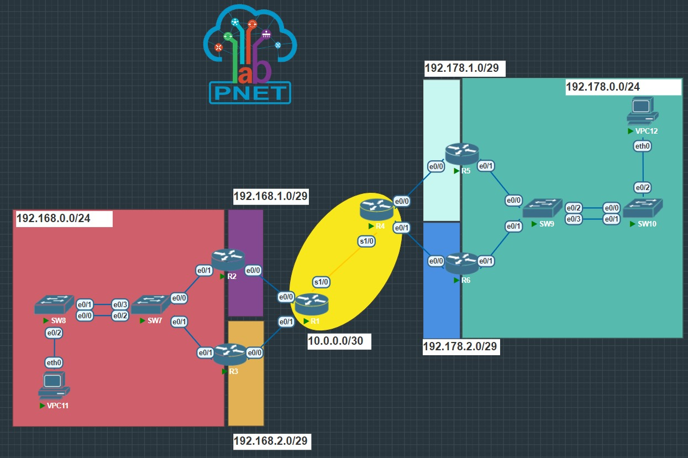

UNIVERSIDAD DE SAN CARLOS DE GUATEMALA

FACULTAD DE INGENIERIA

ESCUELA DE CIENCIAS Y SISTEMAS

LABORATORIO DE REDES Y COMPUTADORAS 1

PRIMER SEMESTRE 2023

ING. PEDRO PABLO HERNÁNDEZ RAMÍREZ

TUTOR EDWIN ANTONIO LÓPEZ ORDÓÑEZ

---

---

---

---

---

---

---

 <h1>PRACTICA #2</h1> 

 <h1>COMUNICACIÓN ENTRE 2 EMPRESAS</h1> 

---

---

---

---

| Nombre   |      Carnet      |  
|----------|:-------------:|
| Daniel Estuardo Chicas Carías    | 201807079 | 

---

---

---

---

---

---

---

---

---

---

# MANUAL DE TÉCNICO
Este documento contiene toda la información sobre los recursos utilizados por el programa para desplegarlo y utilizarlo, explicando todo el trabajo que se ha realizado al crear la topología de red.

>“Programa desarrollado en PNETLab y Wireshark que permite simular una topología de una red para un pequeño negocio de dos niveles.”
## ÍNDICE

| Topico | Link |
| ------ | ------ |
| Introducción | [Ir](#intro) |
| Información del sistema | [Ir](#inf) |
| Objetivos y alcances del sistema| [Ir](#ob) |
| Información del Sistema requerido | [Ir](#sis) |
| Sistema Operativo | [Ir](#sis) |
| Tecnologías utilizadas | [Ir](#tech) | 
| Conclusiones | [Ir](#Conclu) |

## INTRODUCCIÓN
El presente manual técnico tiene como finalidad describir la estructura y diseño del programa que se realizó como parte de Practica 2, así como dar explicación de los como usted como desarrollador puede mejorar y comprender el funcionamiento.

## Informacion del Sistema
La topología de red se define como un mapa físico o lógico de una red para intercambiar datos. En otras palabras, es la forma en que está diseñada la red, sea en el plano físico o lógico. El concepto de red puede definirse como «conjunto de nodos interconectados».

En esta práctica se realizó una topología de red básica, en donde se puede realizar ping entre computadoras de los 2 niveles, donde cada una tiene una ip asignada y se puede realizar captura de paquetes entre ellas.

## Objetivos y alcances del sistema

### Objetivo General
- Que el estudiante demuestre los conocimientos adquiridos en clase y ponga en práctica lo aprendido para configurar enrutamiento entre redes.
### Objetivos Específicos
- Demostrar el conocimiento adquirido respecto a la agregación de enlaces.
- Demostrar el conocimiento adquirido para la creación de rutas estáticas.
- Demostrar el conocimiento adquirido respecto a la puerta de enlace predeterminada, así como también para el manejo de protocolos de redundancia en la misma.
- Emplear la herramienta PNETLab para desarrollar la topología de acuerdo con las especificaciones dadas.

## Especificaciones del Sistema requerido

### Requisitos de Hardware 
|  | PNETLab |
| ------ | ------ |
|Memoria mínima|  1 GB|
|Memoria recomendada |  2 GB|
|Espacio en disco mínimo| 500 MB de espacio libre |
|Espacio en disco recomendado |  1 GB de espacio libre|
|Sistema operativo | Windows 7 o posterior, MacOS X 10.12 o posterior, o Linux con glibc 2.19 o posterior | 
|Procesador | Intel Core i3 o equivalente |

### Requisitos de software
## Sistema operativo 
Windows
- Windows 10 (8u51 y superiors)
- Tener instalado el programa de Proteus y Librerias de Arduino Code u otro editor
- RAM: 128 MB
- Espacio en disco: 124 MB 
- Procesador: Mínimo Pentium 2 a 266 MHz 
- Algún explorador de internet
Mac OS X 
- Tener instalado el programa Proteus Code u otro editor
- Explorador de 64 bits 
- Se requiere un explorador de 64 bits (Safari, Firefox, por ejemplo) para ejecutar Oracle Java en Mac OS X.
Linux
- Oracle Linux 5.5+1 
- Oracle Linux 6.x (32 bits), 6.x (64 bits)2 
- Exploradores: Firefox

## Tecnologías Utilizadas
- PNETLab 

## Conclusiones

### PNETLab: 
- Es una herramienta de simulación de redes de computadoras que permite a los usuarios crear, simular y evaluar diferentes topologías de redes.
- Ofrece una interfaz gráfica de usuario intuitiva y fácil de usar para configurar y visualizar la simulación. 

## Apéndice

  
## TOPOLOGÍA
  

  
## CONFIGURACIÓN DE ROUTERS R1, R2 Y R5
  <a href="#"> 
    # ROUTER 1
     
    # ROUTER 2
     
     
    
    # ROUTER 3
     
     
    
    # ROUTER 5
      
    
    # ROUTER 6
      
    
  </a>

## CONFIGURACIÓN DE SWITCH S7
  

## CONFIGURACIÓN DE MÁQUINA VPC11
  

## COMANDOS UTILIZADOS PARA LA PRÁCTICA
| Comando | Descripción |
| --- | --- |
| enable | Activa el modo de privilegio ejecutivo en el switch o router. |
| configure terminal | Permite al usuario ingresar al modo de configuración global en el switch o router. |
| hostname sw8 / hostname R2 | Permite cambiar el nombre del switch o router a "sw8" o "R2", respectivamente. |
| interface Port-channel 1 | Crea una interfaz de portchannel con el número de puerto 1 en el switch. |
| description conexion a SW7 | Agrega una descripción a la interfaz de portchannel creada. |
| exit | Permite al usuario salir del modo de configuración de interfaz. |
| do show run | Muestra la configuración actual de ejecución en el switch o router. |
| interface range ethernet 0/0-1 | Selecciona los puertos ethernet 0/0 y 0/1. |
| channel-group 1 mode | Agrega los puertos ethernet seleccionados al grupo de canales de puerto 1, utilizando el modo especificado (PAGP o LACP). |
| show etherchannel summary | Muestra un resumen de la configuración del canal de Ethernet en el switch. |
| show lacp neighbor | Muestra información sobre los vecinos LACP del switch. |
| show run interface e0/0 | Muestra la configuración actual del puerto e0/0. |
| configure terminal | Permite al usuario ingresar al modo de configuración global en el switch o router. |
| interface range e0/0-2 | Selecciona los puertos ethernet e0/0, e0/1 y e0/2. |
| no channel-group 1 mode | Desactiva la agrupación de canales de puerto para los puertos seleccionados. |
| ip *ip* *puerta de enlace* / ip address *puerta de enlace* *máscara* | Configura la dirección IP y la puerta de enlace en un dispositivo VPC o router. |
| save | Guarda la configuración actual del dispositivo VPC. |
| standby 1 ip *ip virtual* / glbp 7 ip *ip* | Configura la dirección IP virtual para HSRP o GLBP en un router. |
| standby 1 priority 101 / glbp 7 priority 99 | Configura la prioridad para HSRP o GLBP en un router. |
| standby 1 preempt / glbp 7 load-balancing round-robin | Configura la preemption para HSRP o el balanceo de carga para GLBP en un router. |
| do show standby brief / do show glbp brief | Muestra un resumen de la configuración de HSRP o GLBP en un router. |
| ip route *red que se conecta* *máscara de red* *ip a la que me quiero enlazar* | Agrega una ruta estática a la tabla de enrutamiento de un router. |
| show running-config | section ip route | Muestra la sección de la configuración actual que contiene información sobre las rutas estáticas en un router. |
| /29: 255.255.255.248   /30: 255.255.255.252   /24: 255.255.255.0 | Ejemplos de máscaras de subred utilizadas para definir el tamaño

## Comandos para  Creación de ruta estática, creación de PortChannel con PAGP y LACP, creación de IP virtual con HSRP y GLBP y configuración de VPC.

| Funcionalidad | Comando | Descripción |
| --- | --- | --- |
| Creación de ruta estática | enable  configure terminal  ip route <red> <máscara> <ip> | Habilita el modo privilegiado, entra en la configuración y agrega una ruta estática hacia una red determinada. |
| Creación de PortChannel con PAGP y LACP | enable  configure terminal  hostname <nombre>  interface Port-channel 1  description <descripción>  exit  interface range ethernet 0/0-1  channel-group 1 mode <modo>  show etherchannel summary  show lacp neighbor  show run interface e0/0  configure terminal  interface range e0/0-2  no channel-group 1 mode <modo> | Habilita el modo privilegiado, entra en la configuración, asigna un nombre al switch y configura un PortChannel con PAGP y LACP. Luego, muestra información sobre el PortChannel creado y los puertos que lo conforman. Por último, desactiva los puertos del switch. |
| Creación de IP virtual con HSRP y GLBP | **HSRP:**  enable  configure terminal  hostname R2  interface e0/1  ip address <ip> <máscara>  no shut  standby 1 ip <ip virtual>  standby 1 priority 101  standby 1 preempt  do show standby brief  **GLBP:**  enable  configure terminal  glbp 7 ip <ip>  glbp 7 priority 99  glbp 7 load-balancing round-robin  do show glbp brief | Habilita el modo privilegiado, entra en la configuración, asigna un nombre al router y configura una IP en una interfaz. Luego, configura un IP virtual con HSRP o GLBP y muestra información sobre el protocolo configurado. |
| Configuración de VPC | ip <ip> <puerta de enlace>  save | Configura una dirección IP y una puerta de enlace en una VPC y guarda la configuración. |

## Comandos empleados para la verificación del correcto funcionamiento de los protocolos empleados para la realización de la práctica

| Protocolo | Comando | Descripción |
| --- | --- | --- |
| HSRP | show standby brief | Muestra un resumen de la información de HSRP, incluyendo el estado actual de la interfaz virtual y los routers que participan en el protocolo. |
| GLBP | show glbp brief | Muestra un resumen de la información de GLBP, incluyendo el estado actual de los grupos de balanceo de carga y los routers que participan en el protocolo. |
| VPC | ping <ip> | Verifica la conectividad con otra VPC o con un router mediante la transmisión de paquetes ICMP. |
| Rutas estáticas | show ip route | Muestra la tabla de enrutamiento del router, incluyendo las rutas estáticas que se han configurado. |
| PortChannel | show etherchannel summary  show lacp neighbor  show interfaces port-channel 1 | Muestra un resumen de la información del PortChannel, incluyendo el estado actual, los puertos que lo conforman y los paquetes transmitidos y recibidos por la interfaz. |

