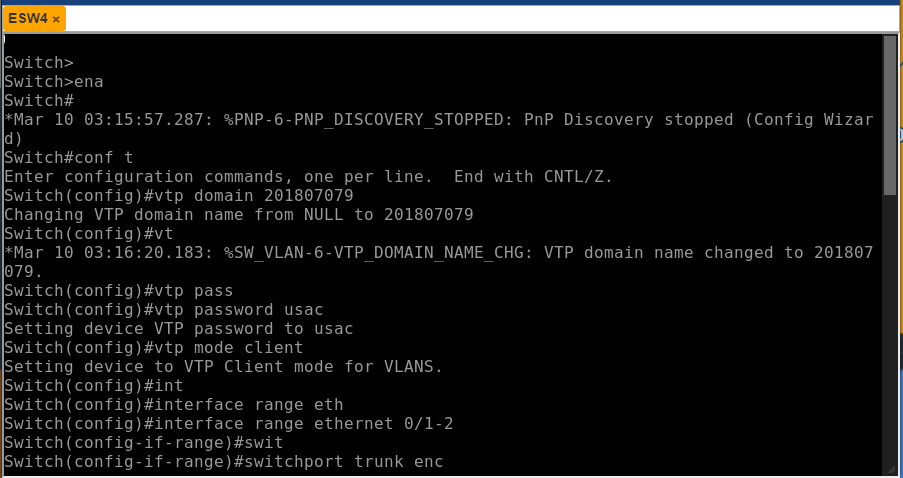
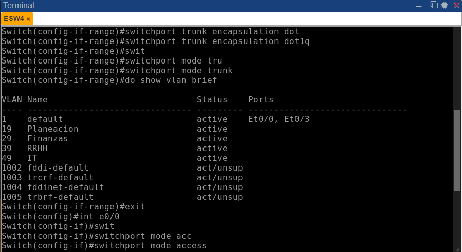
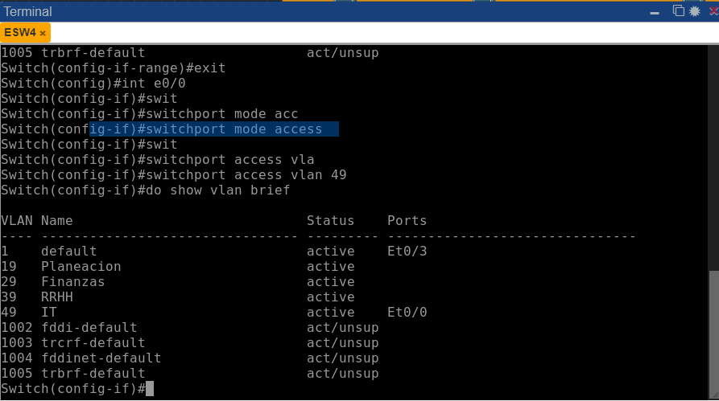

UNIVERSIDAD DE SAN CARLOS DE GUATEMALA

FACULTAD DE INGENIERIA

ESCUELA DE CIENCIAS Y SISTEMAS

LABORATORIO DE REDES Y COMPUTADORAS 1

PRIMER SEMESTRE 2023

ING. PEDRO PABLO HERNÁNDEZ RAMÍREZ

TUTOR EDWIN ANTONIO LÓPEZ ORDÓÑEZ

---

---

---

---

---

---

---

 <h1>PROYECTO #1</h1> 

 <h1>CONSTRUCCIÓN DE RED LOCAL</h1> 

---

---

---

---

| Nombre   |      Carnet      |  
|----------|:-------------:|
| Daniel Estuardo Chicas Carías    | 201807079 | 

---

---

---

---

---

---

---

---

---

---

# MANUAL DE TÉCNICO
Este documento contiene toda la información sobre los recursos utilizados por el programa para desplegarlo y utilizarlo, explicando todo el trabajo que se ha realizado al crear la red local.

>“Programa desarrollado en PNETLab y Wireshark que permite simular una topología de una red donde diferentes departamentos puede existir.”
## ÍNDICE

| Topico | Link |
| ------ | ------ |
| Introducción | [Ir](#intro) |
| Información del sistema | [Ir](#inf) |
| Objetivos y alcances del sistema| [Ir](#ob) |
| Información del Sistema requerido | [Ir](#sis) |
| Sistema Operativo | [Ir](#sis) |
| Tecnologías utilizadas | [Ir](#tech) | 
| Conclusiones | [Ir](#Conclu) |

## INTRODUCCIÓN
El presente manual técnico tiene como finalidad describir la estructura y diseño del programa que se realizó como parte del Proyecto 1, así como dar explicación para los desarrolladores como usted puedan comprender el funcionamiento.

## Informacion del Sistema
La topología de red se define como un mapa físico o lógico de una red para intercambiar datos. En otras palabras, es la forma en que está diseñada la red, sea en el plano físico o lógico. El concepto de red puede definirse como «conjunto de nodos interconectados».

En este proyecto se realizó una topología de red básica, en donde las computadoras del mismo departamento pueden compartir información y con esto ahorrar costos en instalación.

## Objetivos y alcances del sistema

### Objetivo General
- Que el estudiante demuestre los conocimientos adquiridos en clase y cree una red local pequeña.
### Objetivos Específicos
- Demostrar el conocimiento adquirido sobre la creación de VLANS y el protocolo VTP, lo que permitirá la segmentación lógica de la red para mejorar el rendimiento y la seguridad.
- Demostrar el conocimiento adquirido sobre el Spanning Tree Protocol, que garantiza la redundancia y previene los bucles en la red.
- Emplear la herramienta PNETLab para desarrollar la topología de red de acuerdo con las especificaciones dadas.
- Emplear la herramienta Wireshark para realizar capturas de paquetes.

## Especificaciones del Sistema requerido

### Requisitos de Hardware 
|  | PNETLab | Wireshark |
| ------ | ------ | ------ |
|Memoria mínima|  1 GB| 1 GB|
|Memoria recomendada |  2 GB| 2 GB|
|Espacio en disco mínimo| 500 MB de espacio libre | 500 MB de espacio libre|
|Espacio en disco recomendado |  1 GB de espacio libre| 1 GB de espacio libre|
|Sistema operativo | Windows 7 o posterior, MacOS X 10.12 o posterior, o Linux con glibc 2.19 o posterior | Windows 7 o posterior, MacOS X 10.12 o posterior, o Linux con glibc 2.19 o posterior|
|Procesador | Intel Core i3 o equivalente | Intel Core i3 o equivalente|

### Requisitos de software
## Sistema operativo 
Windows
- Windows 10 (8u51 y superiors)
- Tener instalado el programa de Proteus y Librerias de Arduino Code u otro editor
- RAM: 128 MB
- Espacio en disco: 124 MB 
- Procesador: Mínimo Pentium 2 a 266 MHz 
- Algún explorador de internet
Mac OS X 
- Tener instalado el programa Proteus Code u otro editor
- Explorador de 64 bits 
- Se requiere un explorador de 64 bits (Safari, Firefox, por ejemplo) para ejecutar Oracle Java en Mac OS X.
Linux
- Oracle Linux 5.5+1 
- Oracle Linux 6.x (32 bits), 6.x (64 bits)2 
- Exploradores: Firefox

## Tecnologías Utilizadas
- PNETLab
- Wireshark

## Conclusiones

### PNETLab: 
- Es una herramienta de simulación de redes de computadoras que permite a los usuarios crear, simular y evaluar diferentes topologías de redes.
- Ofrece una interfaz gráfica de usuario intuitiva y fácil de usar para configurar y visualizar la simulación.
### Wireshark:
- Es una herramienta de análisis de paquetes de red que permite a los usuarios capturar, ver y analizar el tráfico de red en tiempo real.
- Ofrece una gran cantidad de filtros y opciones de análisis para ayudar a los usuarios a concentrarse en el tráfico relevante y a entender cómo funciona la red.

## Apéndice
 

## RESUMEN DE LAS DIRECCIONES IP Y VLAN

| Departamento | VLAN | VPC        | IP             |
| ------------ | ---- | ----------| --------------|
| Planeación   | 19   | Server_Planeación | 192.168.19.1 |
|              |      | Planeacion_1 | 192.168.19.2 |
| Finanzas     | 29   | SrvFin     | 192.168.29.1 |
|              |      | Finanzas_1 | 192.168.29.2 |
|              |      | Finanzas_2 | 192.168.29.3 |
| RRHH         | 39   | Server_RRHH | 192.168.39.1 |
|              |      | RRHH_1     | 192.168.39.2 |
|              |      | RRHH_2     | 192.168.39.3 |
| IT           | 49   | Server_IT  | 192.168.49.1 |
|              |      | IT_1       | 192.168.49.2 |
|              |      | IT_2       | 192.168.49.3 |

## TOPOLOGÍA
  

## COMANDOS UTILIZADOS
| Comando | Descripción |
| --- | --- |
| `enable` | Activa el modo privilegiado |
| `configure terminal` | Accede al modo de configuración global |
| `vlan numero` | Crea una VLAN con el número especificado |
| `name nombre` | Asigna un nombre a la VLAN creada |
| `interface range ethernet 0/inicio-fin` | Accede a la configuración de un rango de interfaces Ethernet |
| `switchport trunk encapsulation dot1q` | Configura la encapsulación del puerto como 802.1Q |
| `switchport mode trunk` | Configura el puerto en modo trunk |
| `vtp mode server` | Configura el VTP en modo servidor |
| `vtp domain dominio` | Asigna un dominio VTP | 
| `do show vtp status` | Muestra el estado del protocolo VTP |
| `vtp domain dominio` | Configura el dominio VTP |
| `vtp password contraseña` | Configura la contraseña VTP | 
| `interface ethernet 0/puerto` | Accede a la configuración de la interfaz Ethernet 0/puerto | 
| `switchport mode trunk` | Configura el puerto en modo trunk |
| `do show vlan brief` | Muestra una lista de VLANs y sus IDs |
| `do write` | Guarda la configuración actual en la memoria no volátil |
| `interface e0/ruta` | Accede a la configuración de la interfaz Ethernet especificada |
| `switchport mode access` | Configura el puerto en modo acceso |
| `switchport access vlan vlan` | Asigna una VLAN al puerto en modo acceso |
| `show vlan brief` | Muestra una lista de VLANs y sus IDs |
| `show vtp status` | Muestra el estado del protocolo VTP |
| `show spanning-tree` | Muestra la información del protocolo STP | 
| `shutdown` | Apaga el puerto |
| `no shutdown` | Enciende el puerto |
| `hostname nombre` | Cambia el nombre del host |
| `spanning-tree vlan 1 root primary` | Asigna el switch como raíz de la VLAN 1 |
| `spanning-tree mode rapid-pvst` | Configura el protocolo STP en modo rapid PVST |
| `show sp` | Muestra la información del protocolo STP |
| `ip *IP*` | Asigna la dirección IP a una VPC |
| `save` | Guarda la configuración de una VPC |

   
##  PINGS ENTRE HOSTS
  <a href="#">
     # PING ENTRE DEPARTAMENTO DE FINANZAS
     
     # PING ENTRE DEPARTAMENTO DE IT
      
  </a>
  
##  Demostración de que los departamentos no puede compartir información 
  
  

##  CONFIGURACIÓN DE SWITCH
  

##  CONFIGURACIÓN DEL DOMINIO
  

##  CONFIGURACIÓN DE VLAN
  

##  DEMOSTRACIÓN DEL VTP STATUS
   
